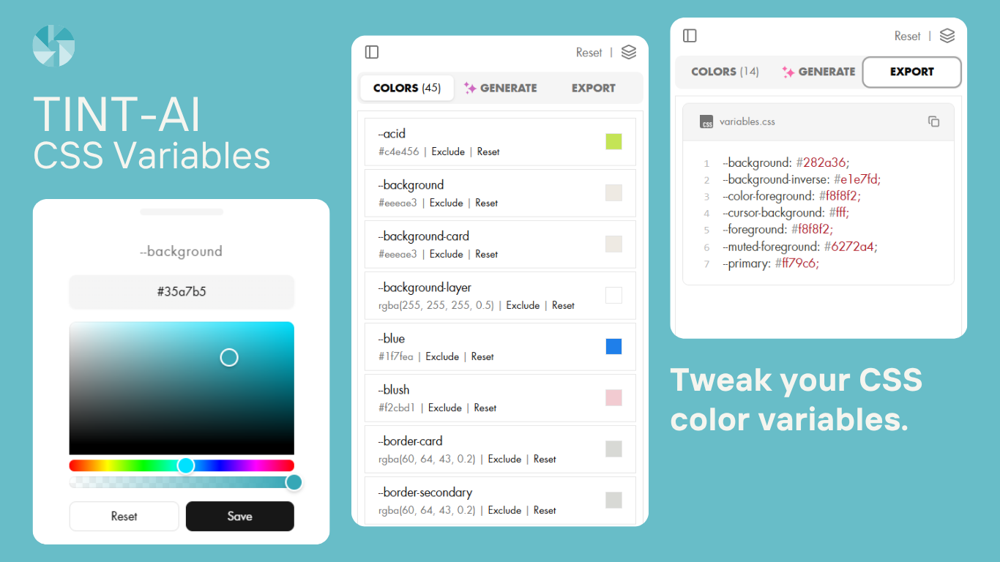

# TintAI

TintAI is a lightweight Chrome extension that helps you discover, edit and generate cohesive CSS color palettes for your website. It detects CSS variables used on the current page, lets you tweak them live, exclude variables, save palettes, export them as CSS, and even generate full palettes using AI.

[Try it now!](https://tint-ai.wadi3.codes) 🎨



## Table of contents

- [Highlights / Features](#highlights--features)
- [Tech stack](#tech-stack)
- [Permissions](#permissions)
- [Usage](#usage)
- [Installation](#installation-local-development)
- [Contributing](#contributing)
- [Troubleshooting](#troubleshooting)
- [Privacy & Security](#privacy--security)
- [License](#license)
- [Author](#author)

## Highlights / Features

- 🎯 Detects CSS custom variables used on the active webpage and lists them in a side panel.
- 🧩 Live editing: pick colors (hex + alpha), edit values, reset to original values and apply them to the page.
- 📌 Exclude variables you don't want to change.
- ✨ Generate cohesive palettes using AI.
- 🎨 Save and manage favorite palettes.
- 📌 Export filtered variables as CSS.
- ⚙️ Supports Chrome DevTools: inspect and modify CSS variables directly from the DevTools panel.

## Tech stack

- TypeScript + React
- Vite
- Tailwind CSS
- Zustand state manager
- react-colorful for color picking
- colorjs.io for color validation/processing
- @google/genai for Gemini integration

## Permissions

The extension requests the following Chrome permissions (manifest v3):

- `sidePanel` — open side panel UI
- `storage` — store API key and saved palettes locally
- `tabs`, `scripting`, `activeTab` — query and inject content script to read/apply CSS variables

## Usage

1. Open any website (non internal chrome pages).
2. Click the extension icon. The side panel reads CSS custom properties from the page and lists them.
3. Edit values directly or open the color picker to choose new colors. Changes are applied live to the page.
4. Use "Exclude" to ignore variables during generation/export.
5. Go to the Generate tab to craft an instruction for Gemini. Provide your Gemini API key and click Generate to create a palette. The extension will attempt to map AI results back to detected CSS variables.
6. Save palettes to reuse them later or export the code from the Export tab.

## Installation (local development)

1. Clone the repo

    ```bash
    git clone https://github.com/EL-OUARDY/tint-ai.git
    cd tint-ai
    ```

2. Install dependencies

    ```bash
   npm install
    ```

3. Run the development server

    ```bash
   npm run dev
    ```

This starts Vite — open the extension in Chrome as an unpacked extension pointing to the built output (see below) or use the `build` step to create production artifacts.

## Build & packaging

1. Build a production bundle

   ```bash
   npm run build
   ```

   - This runs `tsc && vite build` and outputs the extension to the Vite build directory. The repository already includes a `build/` folder used for packaging during development.

2. Create a zip ready for publishing

    ```bash
   npm run zip
   ```

   - This runs the build and packages the result into a zip file using `src/zip.js` and `gulp-zip`.

## Load the extension into Chrome (unpacked)

1. Open chrome://extensions/ in Chrome.
2. Enable "Developer mode" (top-right).
3. Click "Load unpacked" and select the build output directory (for example the folder generated by Vite build or the `build/` directory in the repository when running locally).
4. The extension will appear in the toolbar. Click it to open the side panel for the active tab.

## Contributing

Contributions are welcome. A simple workflow:

1. Fork the repo and create a branch for your change.
2. Follow the existing code style (TypeScript + Prettier). Formatting is available via:

    ```bash
   npm run fmt
   ```

3. Run and test locally with `npm run dev` and build with `npm run build`.
4. Create a PR with a clear description of your changes and any manual testing steps.

Developer notes:

- The project uses `zustand` for state, so look at `src/hooks/useStore.ts` for global state shape.
- UI components live in `src/components/` and are split into small primitives under `src/components/ui/`.

## Troubleshooting

- If no variables are detected: make sure the active tab is not a chrome:// or extension page. Try clicking the "Reload" button in the Colors tab to inject the content script.
- If applying variables fails: the extension tries to inject the content script using the `scripting` API. If permissions are missing or the tab disallows script injection, you will see console warnings in the extension background console.

## Privacy & Security

- Your Gemini API key is stored locally in `chrome.storage.local` and is not transmitted to any third-party server by the extension itself. The extension sends requests directly from the browser to Google's GenAI API when generating palettes.
- The extension only reads and writes CSS custom properties on pages you visit; it does not collect or send other page data to external servers.

## License

This project is licensed under the MIT License.

## Author

Wadi3 (GitHub: EL-OUARDY)
